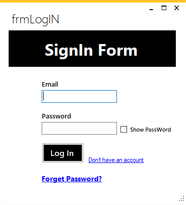
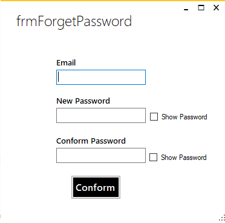
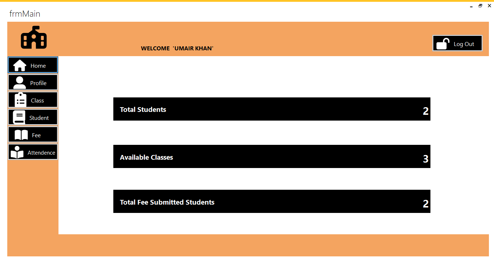
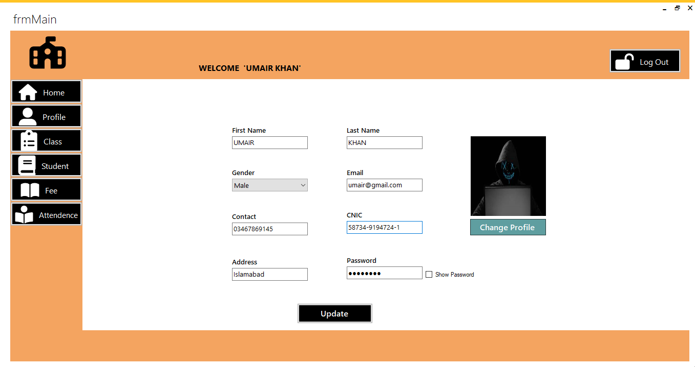
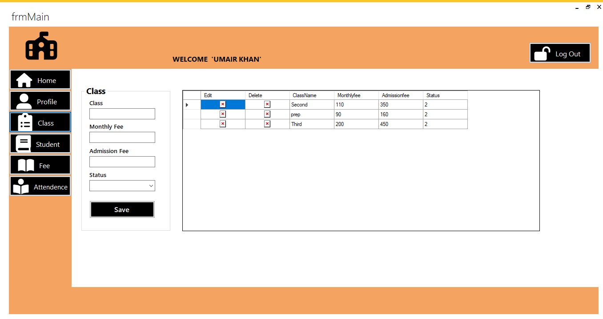
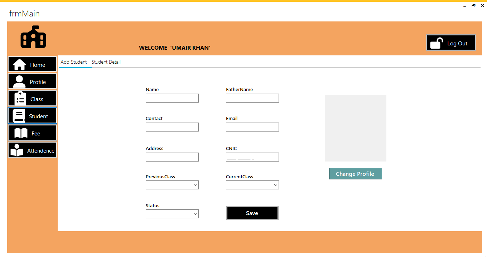
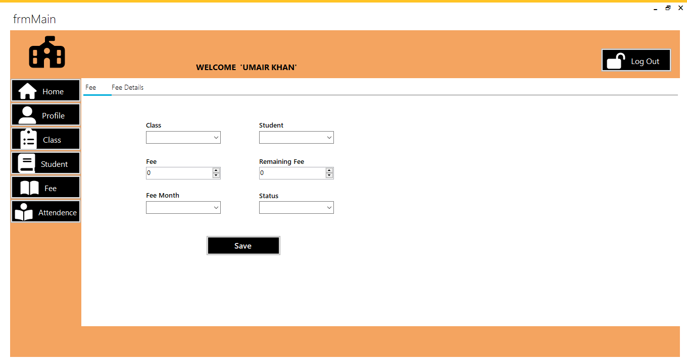
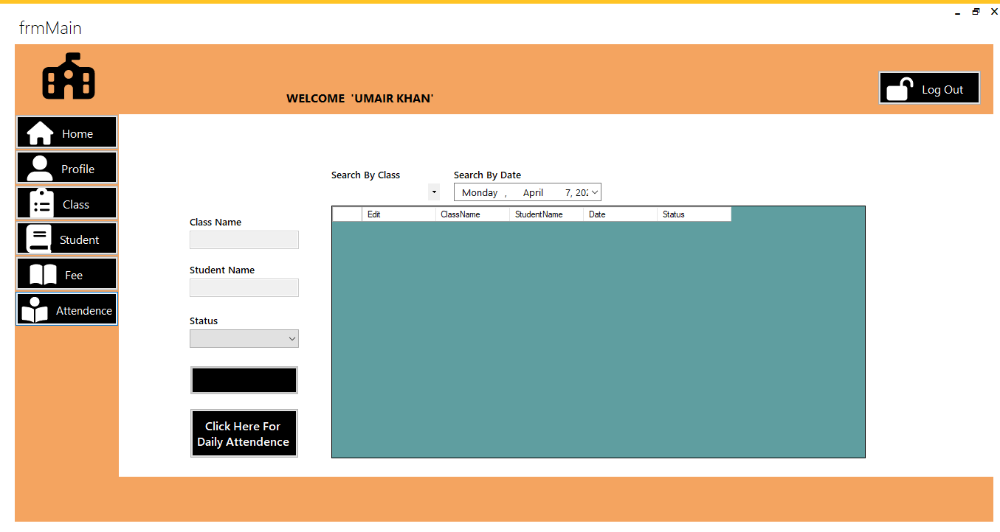

# School Management System

A Windows Forms-based application for managing school operations including student registrations, fee submissions, attendance tracking, and more. Developed in C# using .NET Framework 4.5.2, the system features a modern user interface powered by MetroFramework and FontAwesome, and integrates with stored procedures for efficient database management.

## Features

- **User Registration & Login**  
  Allows users to register and log in. Includes a "Forgot Password" functionality that allows users to reset their password via email verification.

- **Home Page**  
  Displays total students, available classes, and students who have paid their fees.

- **Profile Management**  
  Users can update their profile information.

- **Class Management**  
  Admins can add and manage classes, specifying monthly and admission fees.

- **Student Management**  
  Add and view student details, including uploading student profile pictures.

- **Fee Management**  
  Allows fee submission updates based on class and student selection.

- **Attendance Management**  
  Track and record student attendance, with search functionality to view attendance by class and date.

  ## Technologies Used

- **Programming Language**: C#
- **Framework**: .NET Framework 4.5.2
- **UI Framework**: MetroFramework, FontAwesome
- **Database**: SQL Server (with stored procedures for efficient data manipulation)

   ## 🖼️ Screenshots

### Login

### Forgot Password

### Home

### Profile

### Class

### Student

### Fees

### Attendance

